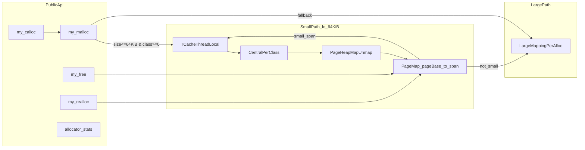

# Memory-Allocator

A custom dynamic memory allocator in C11 with a `malloc`-like API:

- `my_malloc`
- `my_free`
- `my_calloc`
- `my_realloc`
- `allocator_stats`

The implementation is split into:

- a small-object path (size classes, central allocator, per-thread cache), and
- a large-object path (direct OS mapping per allocation).

Compilation is configured for strict diagnostics: `-std=c11 -Wall -Wextra -Werror -pedantic`.

## Design goals

- Provide a clear educational allocator architecture with explicit modules.
- Keep the hot path for small allocations thread-local when possible.
- Use page-granular OS mappings and span metadata for small-object ownership.
- Keep API behavior explicit and testable.

## Public API

Declared in `allocator/include/allocator.h`:

- `void* my_malloc(size_t size);`
- `void my_free(void* ptr);`
- `void* my_calloc(size_t nmemb, size_t size);`
- `void* my_realloc(void* ptr, size_t size);`
- `void allocator_stats(void);`

## API semantics

Behavior implemented and validated by tests:

- `my_malloc(0)` returns `NULL`.
- `my_free(NULL)` is a no-op.
- `my_calloc(nmemb, size)` checks multiplication overflow; on overflow it returns `NULL` and sets `errno = ENOMEM`.
- `my_realloc(NULL, size)` behaves like `my_malloc(size)`.
- `my_realloc(ptr, 0)` frees `ptr` and returns `NULL`.
- Reallocation preserves old bytes up to `min(old_size, new_size)`.
- `allocator_stats()` prints call counters to `stderr` (malloc/free/calloc/realloc).

## High-level architecture



## Small allocation path

### Size classes

Files:

- `allocator/src/internal/size_classes.h`
- `allocator/src/core/size_classes.c`

Constants:

- `ALLOC_MAX_SMALL = 64 * 1024`
- `ALLOC_CLASS_COUNT = 100`

Behavior:

- `my_size_to_class(size)` maps a request to the first class whose object size fits.
- `my_class_to_size(class_idx)` returns object size for that class.
- `my_alignment()` is `16` on 64-bit and `8` on 32-bit.
- `my_class_batch_count(class_idx)` returns refill/release batch sizes based on class size.

### Span metadata and ownership

Files:

- `allocator/src/internal/my_internal.h`
- `allocator/src/core/pagemap.c`
- `allocator/src/platform/page_heap.c`

`my_span` metadata lives at the beginning of each mapped span. Every page in the span is registered into the pagemap (`page_base -> my_span*`), so the allocator can decide if a pointer belongs to the small path.

Pagemap details (current implementation):

- Fixed-capacity open-addressing table with `2^20` slots.
- Protected by a global mutex.

### Central allocator

File:

- `allocator/src/core/central.c`

Model:

- one central bin per size class,
- one mutex per bin,
- a linked list of partially free spans per bin.

Span sizing policy (current implementation):

- Targets ~64 KiB spans for most classes.
- Uses ~256 KiB target spans when `object_size > 4096`.
- Rounds span bytes up to OS page size.

Refill flow (`central_refill`):

1. lock class bin,
2. allocate a span from `page_heap` if no partial span is available,
3. carve objects from span free list,
4. return a batch linked list to the caller.

Release flow (`central_release`):

1. lock class bin,
2. for each object, lookup owning span via pagemap,
3. push object back to span free list,
4. reinsert span into partial list if it was previously full.

### Thread-local cache (tcache)

File:

- `allocator/src/core/tcache.c`

Model:

- `_Thread_local` free list array (`ALLOC_CLASS_COUNT` lists),
- `_Thread_local` object counts per class,
- `_Thread_local` approximate cached byte budget.

Flow:

- On allocate: pop local object; if empty, refill a batch from central.
- On free: push into local list.
- If thread cache exceeds limits, flush one batch back to central.

Limits (current implementation):

- Approximate per-thread cache cap: 4 MiB.
- Additional per-class cap: when a class exceeds ~`2 * batch_count`, one batch is flushed.

## Large allocation path

File:

- `allocator/src/core/large.c`

Behavior:

- one OS mapping per large allocation (`mmap` on POSIX, `VirtualAlloc` on Windows),
- a `large_hdr` in front of user memory stores magic, requested size, mapped size,
- free validates magic and unmaps,
- realloc grows by allocating a new mapping + copying, and shrinks in place by updating requested size.

## Platform layer

File:

- `allocator/src/platform/page_heap.c`

Responsibilities:

- detect system page size,
- map/unmap pages from the OS,
- initialize and register `my_span` for small-path spans.

## Build and run

The repository includes a `Makefile`.

Build everything (library + example + tests):

```bash
make
```

Run the example:

```bash
./example_usage
```

Build and run all functional tests:

```bash
make test
```

Run performance micro-benchmark:

```bash
make perf
```

Build variants:

```bash
make debug
make release
make asan
make tsan
make ubsan
```

Clean artifacts:

```bash
make clean
```

## Tests

Tests under `tests/`:

- `test_basic.c`: base API semantics, alignment, large-path smoke checks, overflow checks.
- `test_stress.c`: randomized mixed allocation/free/realloc workload.
- `test_realloc_preserve.c`: verifies preserved prefix during repeated growth.
- `test_mt.c`: multi-threaded stress and correctness checks.
- `test_perf.c`: quick `my_malloc/free` vs libc timing loop.

## Repository layout

- `allocator/include/` - public API headers.
- `allocator/src/api/` - public API entry points.
- `allocator/src/core/` - allocator core modules (`size_classes`, `utils`, `pagemap`, `central`, `tcache`, `large`).
- `allocator/src/internal/` - internal headers and shared internal types.
- `allocator/src/platform/` - OS abstraction for page mapping and page size.
- `examples/` - sample program.
- `tests/` - unit/stress/perf tests.

## Formatting and development

- Style is controlled by `.clang-format` (LLVM-based, Allman braces, 4 spaces, 100-column limit).
- `.gitignore` ignores local build outputs and generated binaries. If you add new source under `allocator/src/core/`, ensure your ignore rules do not accidentally ignore it.

## Known limitations

- No span scavenging back to OS from central bins yet.
- Fixed-capacity pagemap hash table.
- Invalid pointer frees are tolerated as no-op if they do not match known small span or valid large header.
- Size classes are coarse (100 classes across `1..64KiB`) and prioritize simplicity over minimal fragmentation.

## License

This project is licensed under Apache License 2.0. See `LICENSE`.
